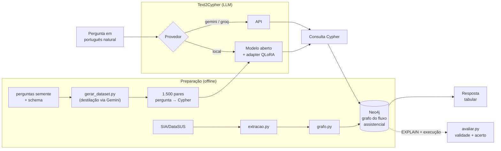
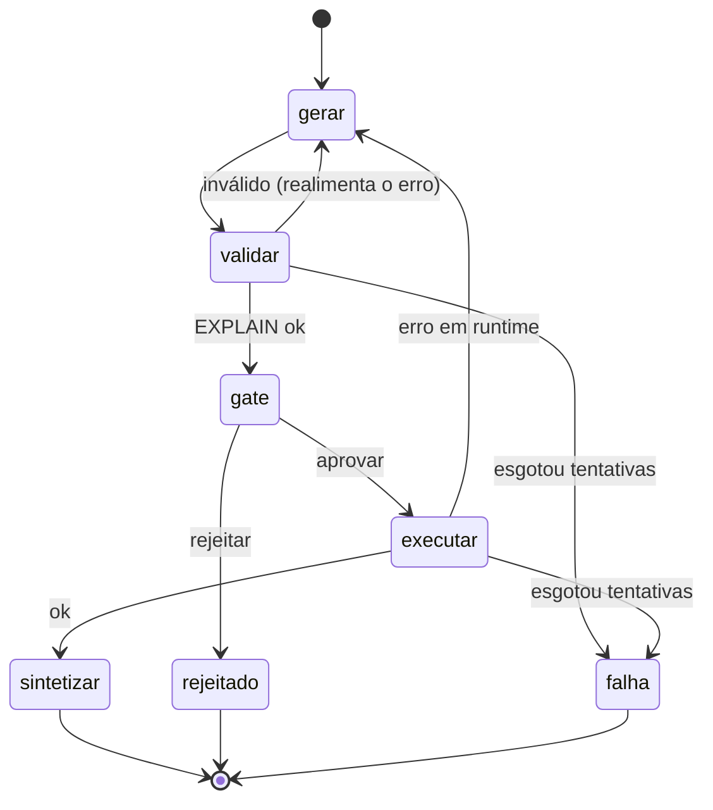

# regionalizacao-sus-graphrag

**Grafo de conhecimento e GraphRAG em português sobre o fluxo assistencial do SUS, com a jornada oncológica (câncer de mama) como aplicação.**

O repositório modela o deslocamento de pacientes entre municípios e regiões de saúde a partir de dados públicos do DataSUS, carrega esse fluxo num grafo Neo4j e permite perguntar em português natural, com a pergunta traduzida para Cypher por LLM (GraphRAG). Um modelo pequeno e aberto é ajustado com QLoRA para essa tradução e comparado com a API.

## O que este repositório comprova

| Requisito | Onde se comprova |
| --- | --- |
| **Fine-tuning LoRA/QLoRA** | `notebooks/02_qlora_kaggle.ipynb` — destila pares pergunta→Cypher do Gemini e treina um modelo aberto com QLoRA |
| **LLM + Grafos de Conhecimento** | `src/grafo.py` + `docker-compose.yml` (Neo4j) — carga do fluxo assistencial como grafo |
| **NLP em português** | `src/text2cypher.py` — pergunta em português → Cypher → resposta |
| **MLOps e avaliação de modelos** | `src/avaliar.py` + `docker-compose.yml` — validade e acerto do Cypher; ambiente reprodutível |
| **Agentes / orquestração** | `src/agente.py` — agente LangGraph com auto-correção, timeout e human-in-the-loop |

## Arquitetura



O caminho de consulta (topo) traduz a pergunta em Cypher por um dos três provedores, executa no Neo4j e devolve a resposta. A preparação (offline) carrega o grafo a partir do SIA e destila o dataset que treina o modelo aberto com QLoRA. `avaliar.py` fecha o ciclo de MLOps comparando os provedores no mesmo conjunto.

## Agente (GraphRAG agêntico)

`src/text2cypher.py` faz o caminho de disparo único: pergunta → um Cypher → resposta. Em dados de saúde isso é frágil — se o modelo erra o Cypher, a consulta simplesmente falha, e nada garante revisão antes de rodar. `src/agente.py` envolve o mesmo Text2Cypher num **agente de estados (LangGraph)** com quatro capacidades que o disparo único não tem:

- **Auto-correção** — se o Cypher falha no `EXPLAIN` (ou na execução), a mensagem de erro do Neo4j volta ao prompt e o modelo gera de novo, até `--max-tentativas`.
- **Timeout por passo** — cada execução no Neo4j tem limite de tempo, para não travar em consulta pesada ou modelo local lento.
- **Human-in-the-loop** — antes de executar, um gate pausa o grafo (`interrupt` do LangGraph) e pede **aprovar / editar / rejeitar** o Cypher. Nada roda sem revisão (`--auto` desliga o gate).
- **Síntese** — as linhas do grafo viram uma resposta em português: o *generation* que fecha o ciclo do RAG.



Reaproveita `montar_prompt`/`LLM` (geração), o `EXPLAIN` (validação) e a execução no Neo4j dos módulos existentes; o que `agente.py` acrescenta é a orquestração — nós, arestas condicionais, estado e o `interrupt`.

```
python src/agente.py "Quais regiões de saúde mais enviam pacientes de câncer para fora?" --provider ollama --auto
```

```
Cypher     : MATCH (o:RegiaoSaude)-[f:FLUXO]->(:RegiaoSaude) WHERE f.deslocou = true
             RETURN o.nome AS regiao, sum(f.volume) AS evasao ORDER BY evasao DESC LIMIT 10
Tentativas : 1   Status: ok

regiao                | evasao
----------------------+-------
Aracatuba Oeste       | 12866
Aracatuba             | 12714
...

Resposta: As regiões que mais enviam pacientes de câncer para fora são Araçatuba Oeste,
Araçatuba e Araçatuba Leste, seguidas de Registro e Sorocaba.
```

Sem `--auto`, o agente pausa e mostra o Cypher para revisão antes de executá-lo — o revisor pode aprovar, reescrever ou rejeitar.

## Domínio

O SUS se organiza em regiões de saúde. Quando residência e local de atendimento pertencem a regiões distintas, há **deslocamento inter-regional**. O câncer serve como condição traçadora: depende de alta complexidade, concentra-se em polos estaduais e tem bom registro na Autorização de Procedimentos de Alta Complexidade (APAC). O grafo torna esse fluxo consultável: quais regiões evadem, quais polos concentram a atração, por complexidade e por linha de cuidado.

Recorte do exemplo: estado de São Paulo, SIA/SUS 2019 a 2024, dados públicos.

## Estrutura

```
.
├── schema/grafo.md          # esquema do grafo (nós, relações, propriedades)
├── src/
│   ├── extracao.py          # DataSUS (SIA) -> tabela de fluxo
│   ├── grafo.py             # tabela de fluxo -> Neo4j
│   ├── text2cypher.py       # pergunta PT -> Cypher -> resposta (API e modelo local)
│   ├── agente.py            # agente LangGraph: auto-correção + HITL + síntese
│   ├── gerar_dataset.py     # dataset sintético pergunta->Cypher via Gemini (destilação)
│   └── avaliar.py           # validade e acerto do Cypher gerado
├── notebooks/
│   ├── 01_exploracao.ipynb  # fluxo assistencial: exploração dos dados
│   └── 02_qlora_kaggle.ipynb# fine-tuning QLoRA (GPU gratuita do Kaggle)
├── eval/perguntas.yaml      # conjunto de avaliação: pergunta + Cypher de referência
├── docker-compose.yml       # Neo4j
└── data/                    # raw/ e processed/ (fora do versionamento)
```

## Como rodar

```
cp .env.example .env        # preencha as chaves
docker compose up -d        # sobe o Neo4j
pip install -r requirements.txt

python src/extracao.py      # baixa e prepara o fluxo (SIA/SP)
python src/grafo.py         # carrega o grafo no Neo4j
python src/text2cypher.py "Quais regiões de saúde mais enviam pacientes de câncer para fora?"
python src/agente.py "..." --provider ollama   # mesma pergunta, com auto-correção + HITL
python src/avaliar.py       # roda o conjunto de avaliação
```

O fine-tuning roda à parte, no Kaggle: abra `notebooks/02_qlora_kaggle.ipynb`, gere o dataset com `src/gerar_dataset.py`, treine e traga o adapter de volta.

## Avaliação

O harness `src/avaliar.py` mede a métrica que de fato importa em Text2Cypher — **validade** (o Cypher gerado passa no `EXPLAIN` do Neo4j) e **acerto de execução** (rodado, retorna o mesmo resultado que o Cypher de referência) —, porque duas consultas escritas de formas diferentes podem estar as duas corretas.

**Execução (medido).** Cada provedor gera o Cypher, validado no `EXPLAIN` e executado contra o grafo (Neo4j Aura), no conjunto curado `eval/perguntas.yaml` (10 perguntas):

| Modelo | Cypher válido (`EXPLAIN`) | Resposta correta (execução) | Tokens (10 q) |
| --- | --- | --- | --- |
| Mistral Codestral (API) | 100% | 60% | 10,2k |
| qwen2.5-coder:7b (Ollama, local, sem chave) | 100% | 50% | 10,4k |
| Gemini 2.0 Flash (API) | 70% † | 60% | 6,8k |

O especialista em código (Codestral) e o modelo aberto local de 7B produzem Cypher **sempre sintaticamente válido**; a diferença aparece no acerto de execução. "Correto" é estrito — exige as mesmas linhas com os mesmos nomes de coluna, então vários quase-acertos (resposta certa sob outro alias, ou sem `ORDER BY`) contam como erro, o que torna 50–60% um piso.

† O Gemini respondeu 7 das 10 perguntas antes de esgotar a cota do free tier (dessas, 6 corretas); as 3 falhas são limite de API, não do modelo.

**Fine-tuning (medido).** O modelo **Qwen2.5-1.5B**, ajustado com LoRA sobre 1.500 pares pergunta→Cypher destilados do Gemini, avaliado em 150 perguntas de validação (split fixo, `seed=42`) por correspondência ao Cypher de referência. O treino rodou na GPU gratuita do Kaggle e exigiu várias iterações para estabilizar o ambiente (bitsandbytes/CUDA na GPU sorteada), caindo para LoRA em fp16 com o bloco QLoRA 4-bit documentado como opção.

| Modelo | Acerto exato | Acerto estrutural | n |
| --- | --- | --- | --- |
| Qwen2.5-1.5B + LoRA (destilado, 1.500 pares) | 6,0% | 8,7% | 150 |

"Acerto estrutural" ignora nomes de variável. Os números são modestos e esperados para um 1,5B destilado com poucos milhares de pares: ele aprende o esquema mas ainda trunca antes de fechar `WHERE`/`RETURN`. O contraste com os modelos de 7B+ acima mostra o efeito do tamanho; mais dados de destilação é a alavanca seguinte.

> **Dados:** o exemplo roda sobre uma **amostra sintética representativa** (20 regiões, 127 municípios, ~2 mil arestas de fluxo, ~30% de deslocamento, retenção caindo com a complexidade). O caminho de extração do SIA/DataSUS real existe em `src/extracao.py`; a amostra mantém o repositório leve e reprodutível.

## Fontes de dados

Todas públicas: SIA/SUS via FTP do DataSUS; malha oficial município→região de saúde (DATASUS/e-Gestor); IBGE (população) e IPEA (renda) para atributos do município. Dados brutos não são versionados (ver `.gitignore`).

## Licença

MIT. Autoria individual de Isabela Venancio da Silva.
